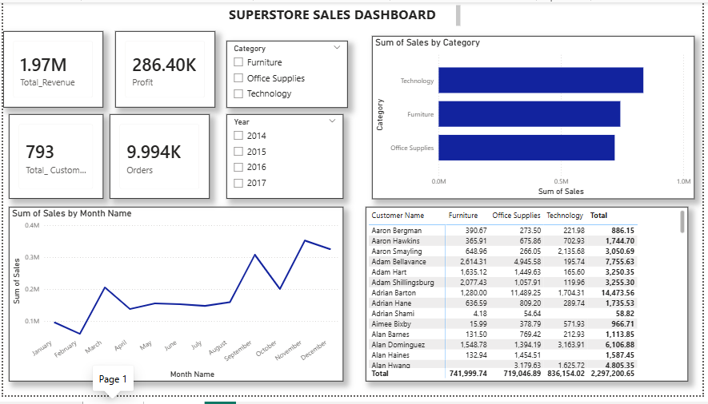
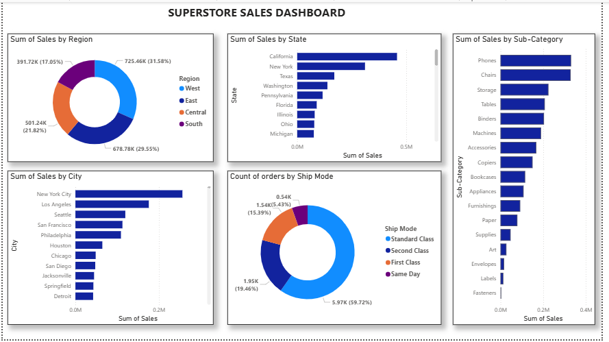

# SUPERSTORE_SALES_PERFORMANCE_DASHBOARD-POWER-BI
A POWER BI DASHBOARD BUILT TO ANALYZE SALES TRENDS AND CUSTOMER BEHAVIOUR FROM A SUPERSTORE DATASET SPANNING 2014-2017.

## Overview
This project takes raw transactional data from a retail store and turns it into an interactive analytics dashboard. The original flat data was broken down into a relational model (Main_sales, Products and Customers).
The dashboard tracks important KPIs like total revenue, profit, customer count and order count while offering deep dives into sales performance across different product categories, cities and states.

## Business Questions
1. What is the overall financial performance?
2. Are monthly sales growing or declining over time?
3. Which product categories bring in the highest revenue?
4. Who are our high value customers and what product category are they buying?
5. How is sales performance geographically?
6. What is the most preferred shipping method?

## Dashboard visualizations and insights
#### 1. KPIs
1. Total revenue 
2. Profit 
3. Number of customers
4. Total orders
   
  
  
  
  
#### 2. Total sales per product category - Bar chart
Shows the sales performance of each product category (Technology, Furniture and Office Supplies).  
This helps the business know its revenue driver.

#### 3. Monthly sales over time - Line chart
Shows sales performance trend over each month which helps identify peak seasons and sales declines over the years.

#### 4. Sales by customers and product category - Matrix table
Breaks down each individual customer's spending and what product category they spend on.  
This helps the business know its high value and loyal customers to help in targeted marketing and promos.

#### 5. Sales by region - Donut chart
It shows the total sales for each region and its percentage contribution to the total revenue.  
This is useful for marketing, inventory and overall budgeting.

#### 6. Count of orders per shipping mode - Donut chart
It shows the number of orders for each shipping mode and its percentage to the total orders.  
This helps the business know the most preferred shipping mode and how to streamline its operations.

#### 7. Sales by city and state - Bar charts
Shows the sales performance by each city and state.  
This is useful for marketing, inventory and overall budgeting.

## Tools
Power-BI

