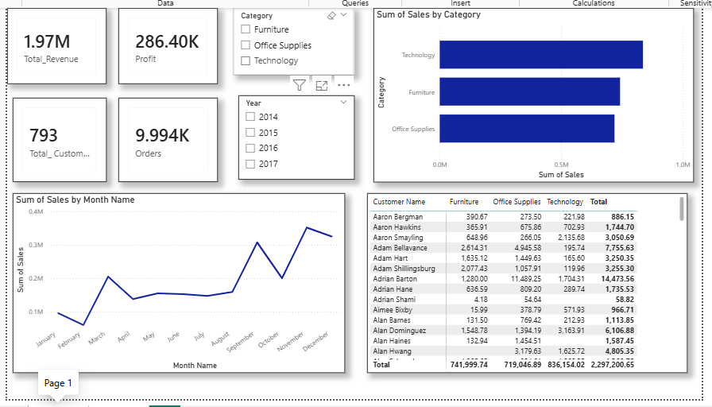

# SUPERSTORE_SALES_PERFORMANCE_DASHBOARD-POWER-BI
A POWER BI DASHBOARD BUILT TO ANALYZE SALES TRENDS AND CUSTOMER BEHAVIOUR FROM A SUPERSTORE DATASET SPANNING 2014-2017.

## Overview
This project takes raw transactional data from a retail store and turns it into an interactive analytics dashboard. The original flat data was broken down into a relational model (Main_sales, Products and Customers).
The dashboard tracks important KPIs like total revenue, profit, customer count and order count while offering deep dives into sales performance across different product categories, cities and states.

## Business Questions
1. What is the overall financial performance?
2. Are monthly sales growing or declining over time?
3. Which product categories bring in the highest revenue?
4. Who are our high value customers and what product category are they buying?
5. How is sales performance geographically?
6. What is the most preferred shipping method?

## Insights

